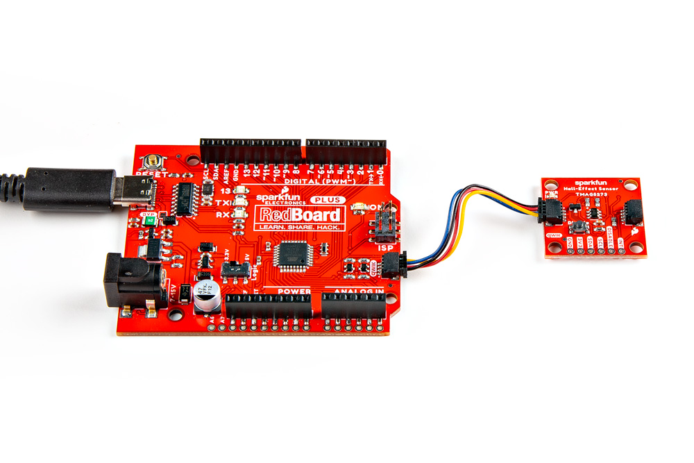
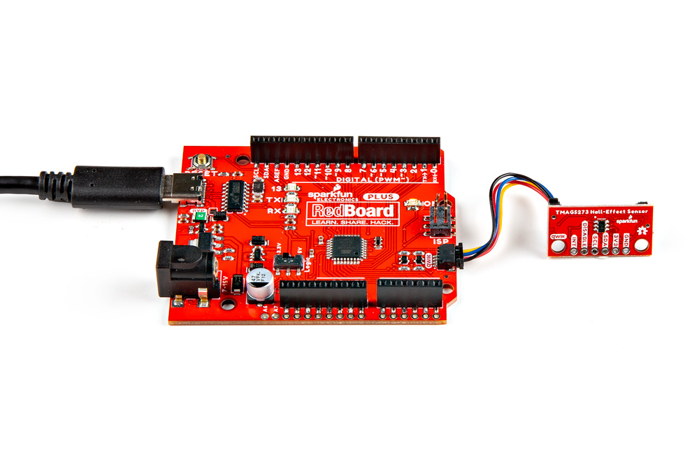
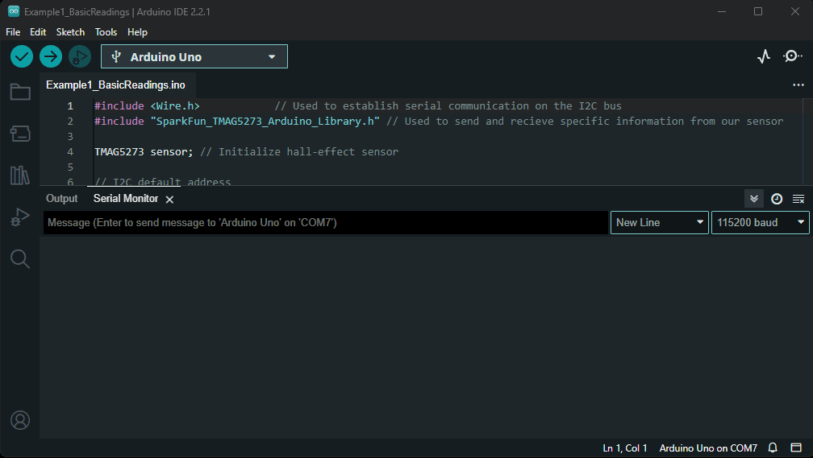

## Description
Once the [Arduino library has been installed](../software_overview/#sparkfun-TMAG5273-arduino-library), the [`Example1_BasicReadings.ino`](https://github.com/sparkfun/SparkFun_TMAG5273_Arduino_Library/blob/main/examples/Example1_BasicReadings) example file can be accessed from the **File** > **Examples** > **SparkFun TMAG5273 Arduino Library** > **Example1_BasicReadings** drop-down menu. This example reads the raw magnetic flux (mT) and temperature (&deg;C) data from the TMAG5273 sensor through the I<sup>2</sup>C interface and displays them in the [Serial Monitor](https://learn.sparkfun.com/tutorials/112).

??? code "`Example1_BasicReadings.ino`"
	??? info "Code Verification"
		This code was last verified to be functional under the following parameters:

		```
		Arduino IDE Version: 2.2.1
		Arduino Library Version: 1.0.3

		Hardware Platform:
		- SparkFun RedBoard Plus
		- SparkFun Linear 3D Hall-Effect Sensor - TMAG5273 (Qwiic)
		- SparkFun Mini Linear 3D Hall-Effect Sensor - TMAG5273 (Qwiic)
		```

	```cpp linenums="1"
	--8<-- "https://raw.githubusercontent.com/sparkfun/SparkFun_TMAG5273_Arduino_Library/main/examples/Example1_BasicReadings/Example1_BasicReadings.ino"
	```


## Hardware Connections
For this example, users simply need to connect their Qwiic Hall-Effect Sensor board to their microcontroller, utilizing the I<sup>2</sup>C interface. With the recommended hardware, users can easily connect their boards with the Qwiic connection system.

<div class="grid" markdown>

<div markdown>
<figure markdown>
[{ width="400" }](./assets/img/hookup_guide/example-basic-1x1.jpg "Click to enlarge")
</figure>
</div>

<div markdown>
<figure markdown>
[{ width="400" }](./assets/img/hookup_guide/example-basic-mini.jpg "Click to enlarge")
</figure>
</div>

</div>

<center>
*The Qwiic Hall-Effect Sensor boards are connected to a [RedBoard Plus](https://www.sparkfun.com/products/18158), with a [Qwiic cable](https://www.sparkfun.com/products/15081).*
</center>

??? info "Pin Connections"
	For users with a development board without a Qwiic connector, the table below illustrates the required pin connections. Make sure that the logic-level of the sensor is compatible with the development board that is being connected.

	<center>

	| Sensor Pin | Microcontroller Pin | RedBoard/Uno |
	| :--------: | :------------------ | :----------: |
	| `SCL` | I<sup>2</sup>C - Serial Clock | `SCL`/`A5` |
	| `SDA` | I<sup>2</sup>C - Serial Data  | `SDA`/`A4` |
	| `3V3` | Power: **1.7 to 3.6V**        | `3.3V`     |
	| `GND` | Ground                        | `GND`      |

	</center>

## Serial Monitor
This example reads the magnetic flux (mT) and temperature values (&deg;C) from the TMAG5273 sensor and displays them in the [Serial Monitor](https://learn.sparkfun.com/tutorials/112).

<figure markdown>
[{ width="400" }](./assets/img/hookup_guide/example-basic.gif "Click to enlarge")
<figcaption markdown>
The magnetic flux (mT) and temperature (&deg;C) values streamed from the TMAG5273 sensor into the [Serial Monitor](https://learn.sparkfun.com/tutorials/112).
</figcaption>
</figure>

!!! tip
	For this example to work, users will need to move a magnet near the sensor.
