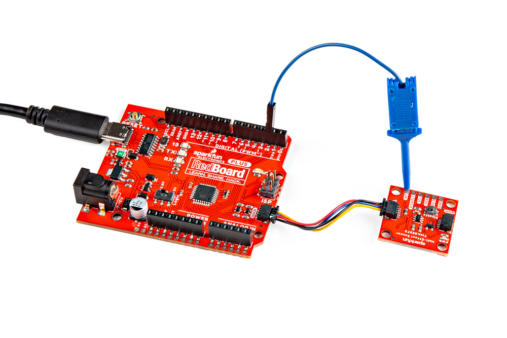
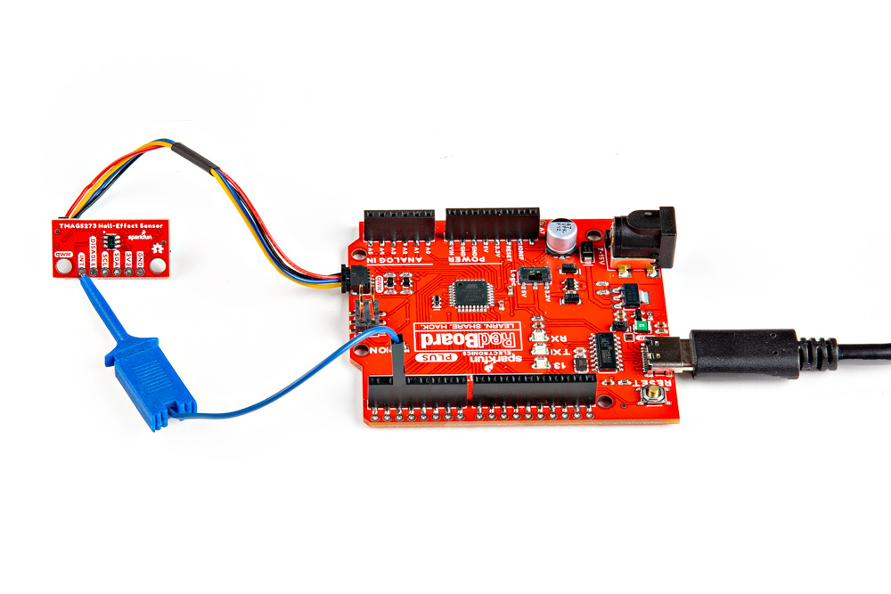
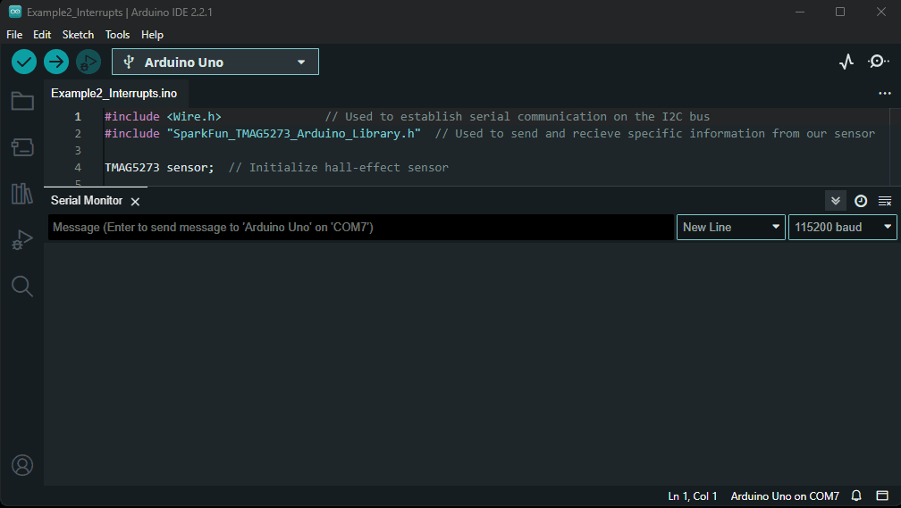

## Description
The [`Example2_Interrupts.ino`](https://github.com/sparkfun/SparkFun_TMAG5273_Arduino_Library/blob/main/examples/Example2_Interrupts) example file can be accessed from the **File** > **Examples** > **SparkFun TMAG5273 Arduino Library** > **Example2_Interrupts** drop-down menu. This example builds upon the previous code in [`Example1_BasicReadings.ino`](https://github.com/sparkfun/SparkFun_TMAG5273_Arduino_Library/blob/main/examples/Example1_BasicReadings). Instead of constantly streaming the sensor values from the TMAG5273, the microcontroller enables a magnetic threshold interrupt on the x-axis. Then, it waits until an interrupt is triggered on the `INT` pin before the data is retrieved through the I<sup>2</sup>C interface.

??? code "`Example2_Interrupts.ino`"
	??? info "Code Verification"
		The code modification was last verified to be functional under the following parameters:

		```
		Arduino IDE Version: 2.2.1
		Arduino Library Version: 1.0.3

		Hardware Platform:
		- SparkFun RedBoard Plus
		- SparkFun Linear 3D Hall-Effect Sensor - TMAG5273 (Qwiic)
		- SparkFun Mini Linear 3D Hall-Effect Sensor - TMAG5273 (Qwiic)
		```

	!!! warning "Required Modification"
		This code was developed to be utilized with the ESP32 on the [IoT Motor Driver](https://www.sparkfun.com/products/22132). Users will need to modify the example code, to utilize the interrupt pins of the ATmega328P on the RedBoard Plus. Replace {--uint8_t intPin = 4;--} with {++uint8_t intPin = 2;++} to utilize the `D2` pin on the RedBoard Plus, which can handle interrupts.

		<div class="grid" markdown>

		<div markdown>

		**Original Code:**

		```cpp hl_lines="3"
		--8<-- "https://raw.githubusercontent.com/sparkfun/SparkFun_TMAG5273_Arduino_Library/main/examples/Example2_Interrupts/Example2_Interrupts.ino:9:11"
		```

		</div>

		<div markdown>

		**Modified Code:**

		```cpp hl_lines="3"
		// Interrupt pin used
		// NOTE: This pin is specific to the SparkFun IoT Motor Driver
		uint8_t intPin = 2;
		```

		</div>

		</div>

	```cpp linenums="1"
	--8<-- "https://raw.githubusercontent.com/sparkfun/SparkFun_TMAG5273_Arduino_Library/main/examples/Example2_Interrupts/Example2_Interrupts.ino"
	```


## Hardware Connections
For this example, users simply need to connect their Qwiic Hall-Effect Sensor board to their microcontroller, utilizing the I<sup>2</sup>C interface and interrupt pin. Users can easily connect the I<sup>2</sup>C interface with the Qwiic connection system on their boards. To connect the interrupt pin, we recommend utilizing an [IC-hook](https://www.sparkfun.com/products/9741) for a temporary connection.

<div class="grid" markdown>

<div markdown>
<figure markdown>
[{ width="400" }](./assets/img/hookup_guide/example-interrupt-1x1.jpg "Click to enlarge")
</figure>
</div>

<div markdown>
<figure markdown>
[{ width="400" }](./assets/img/hookup_guide/example-interrupt-mini.jpg "Click to enlarge")
</figure>
</div>

</div>

<center>
*The Qwiic Hall-Effect Sensor boards are connected to a [RedBoard Plus](https://www.sparkfun.com/products/18158), with a [Qwiic cable](https://www.sparkfun.com/products/15081) and an [IC-hook](https://www.sparkfun.com/products/9741).*
</center>

??? info "Pin Connections"
	For users with a development board without a Qwiic connector, the table below illustrates the required pin connections. Make sure that the logic-level of the sensor is compatible with the development board that is being connected.

	<center>

	| Sensor Pin | Microcontroller Pin | RedBoard/Uno |
	| :--------: | :------------------ | :----------: |
	| `INT` | Interrupt Pin                 | `D2`       |
	| `SCL` | I<sup>2</sup>C - Serial Clock | `SCL`/`A5` |
	| `SDA` | I<sup>2</sup>C - Serial Data  | `SDA`/`A4` |
	| `3V3` | Power: **1.7 to 3.6V**        | `3.3V`     |
	| `GND` | Ground                        | `GND`      |

	</center>

## Serial Monitor
This example waits until an interrupt is triggered by the magnetic threshold before data is retrieved from the TMAG5273 sensor. The data is then displayed in the [Serial Monitor](https://learn.sparkfun.com/tutorials/112).

<figure markdown>
[{ width="400" }](./assets/img/hookup_guide/example-interrupt.gif "Click to enlarge")
<figcaption markdown>
The magnetic flux (mT) and temperature (&deg;C) values streamed from the TMAG5273 sensor into the [Serial Monitor](https://learn.sparkfun.com/tutorials/112).
</figcaption>
</figure>

!!! tip
	For this example to work, users will need to move a magnet near the sensor to trigger the interrupt.

	!!! warning
		The casing of rare Earth magnets is often conductive. Users should take precautions to avoid shorting out the components or electrical contacts with these types of magnets.
