## Board Dimensions
The Qwiic Hall-Effect Sensors are laid out in the standardized 0.5"x 1" (1.77 x 2.54 cm) *mini* form-factor and the regular, 1" x 1" (2.54 x 2.54 cm) Qwiic breakout board. These boards also include standard 0.13" mounting holes, which are compatible with 4-40 screws. The dimensions of these boards are illustrated in the drawings below, where the listed measurements are in inches.

<figure markdown>
[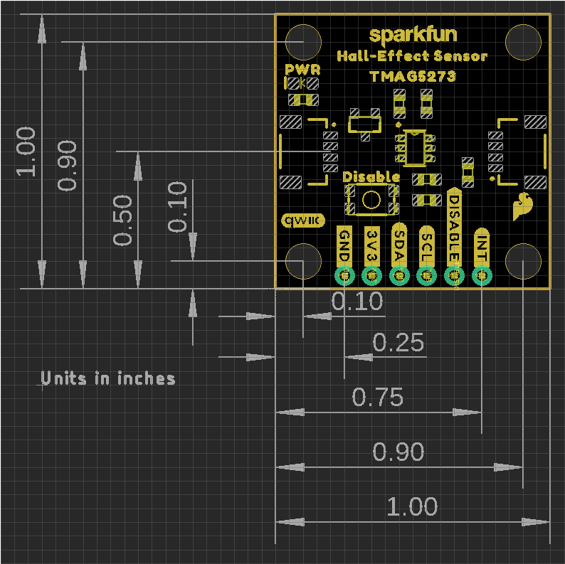{ width="310" }](./assets/img/hookup_guide/dimensions-1x1.png "Click to enlarge")
</figure>

<figure markdown>
[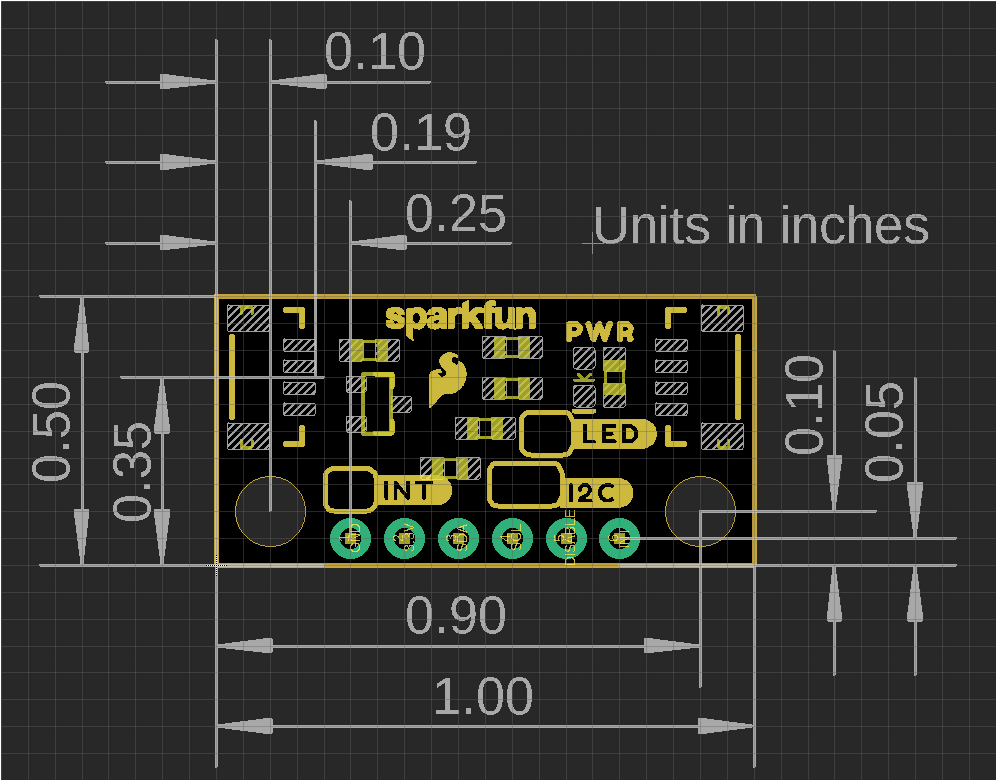{ width="400" }](./assets/img/hookup_guide/dimensions-mini.png "Click to enlarge")
</figure>

*[Dimensions (PDF)](./assets/board_files/dimensions.pdf) for the Qwiic Hall-Effect Sensor boards, in inches.*

??? tip "Need more measurements?"
	For more information about the board's dimensions, users can download the [eagle files](./assets/board_files/eagle_files.zip) for the boards. These files can be opened in Eagle and additional measurements can be made with the dimensions tool.

	??? info ":octicons-download-16:{ .heart } Eagle - Free Download!"
		Eagle is a [CAD]("computer-aided design") program for electronics that is free to use for hobbyists and students. However, it does require an account registration to utilize the software.

		

		[Download from :autodesk-primary:{ .autodesk }](https://www.autodesk.com/products/eagle/free-download "Go to downloads page"){ .md-button .md-button--primary width="250px" }
		

	??? info ":straight_ruler: Dimensions Tool"
		This video from Autodesk demonstrates how to utilize the dimensions tool in Eagle, to include additional measurements:

		

		

		<iframe src="https://www.youtube.com/embed/dZLNd1FtNB8" title="EAGLE Dimension Tool" frameborder="0" allow="accelerometer; autoplay; clipboard-write; encrypted-media; gyroscope; picture-in-picture" allowfullscreen></iframe>
		

		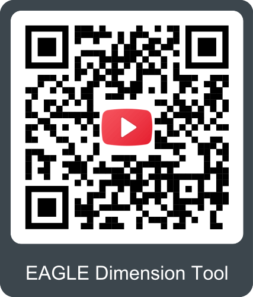{ .qr }
		

## Power
The TMAG5273 requires a supply voltage between **2.3 to 3.6V** (1). This power can be provided to the board, either, through one of the *polarized* Qwiic connectors or the dedicated 3.3V (`3V3`) and ground (`GND`) [PTH](https://en.wikipedia.org/wiki/Through-hole_technology "Plated Through Holes") pins broken out on the board.
{ .annotate }

1. While the sensor's listed voltage range is 1.7 to 3.6V, its under-voltage range is 1.9 to 2.2V. Users may find that their sensor is unresponsive below 2.3V.

<figure markdown>
[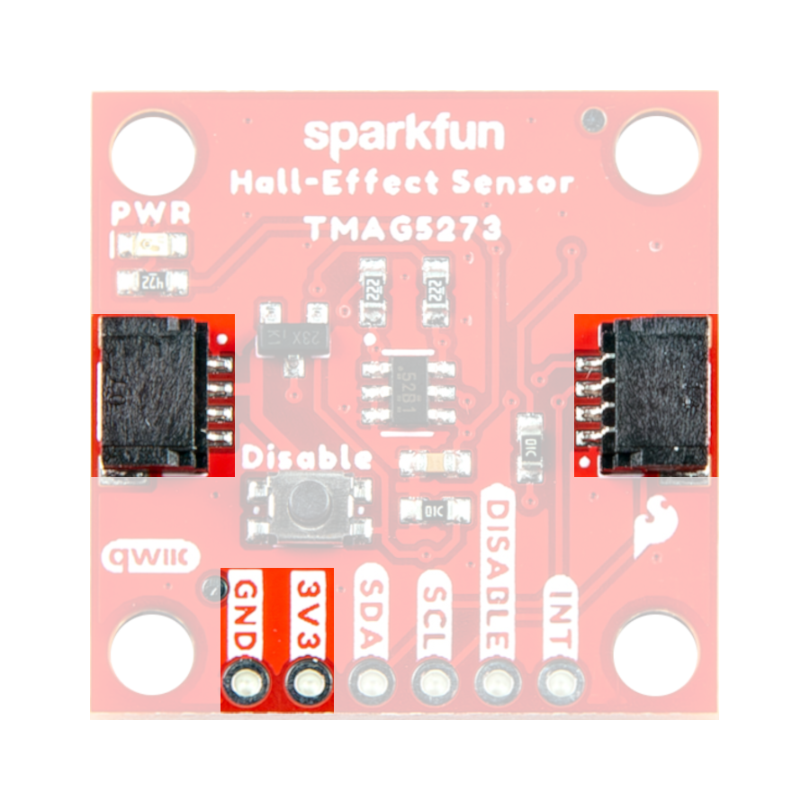{ width="400" }](./assets/img/hookup_guide/power_connections-1x1.png "Click to enlarge")
</figure>

<figure markdown>
[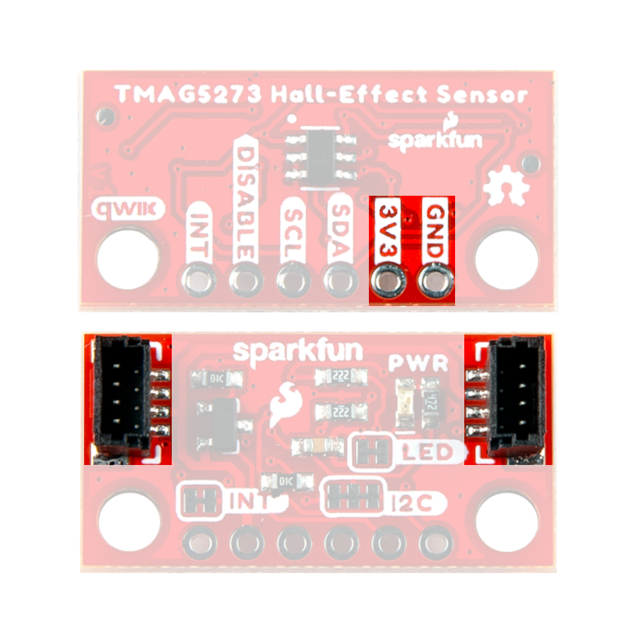{ width="400" }](./assets/img/hookup_guide/power_connections-mini.png "Click to enlarge")
</figure>

*Qwiic Hall-Effect Sensor boards' power connections.*

!!! warning
	The Qwiic connect system is meant to run on **3.3V**. Ensure that another voltage is not being supplied through the PTH pins when utilized in conjunction with this system.

	??? tip "Under-Voltage Threshold"
		The under-voltage threshold of the TMAG5273 is **1.9 to 2.2V**. It is recommended that users provide an input voltage between **2.3 to 3.6V**.

!!! info
	For more details, users can reference the [schematic](./assets/board_files/schematic.pdf) and the [TMAG5273 datasheet](./assets/component_documentation/tmag5273.pdf).

### Power Status LED
The red, `PWR` LED will begin to light up once **~1.4V** is supplied to the board; however, for most users, it will light up when **3.3V** is supplied through the Qwiic connector. A jumper is available to disconnect the power from the LED, for low-power applications (see Jumpers section below).

<figure markdown>
[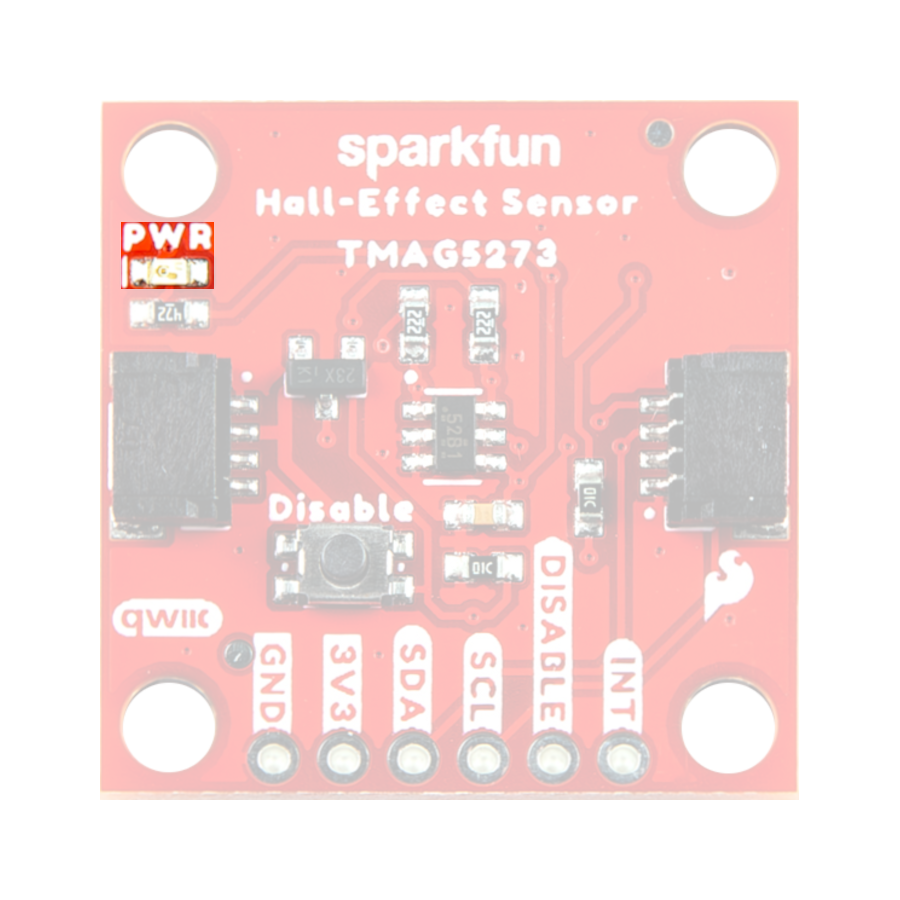{ width="400" }](./assets/img/hookup_guide/LED-power-1x1.png "Click to enlarge")
</figure>

<figure markdown>
[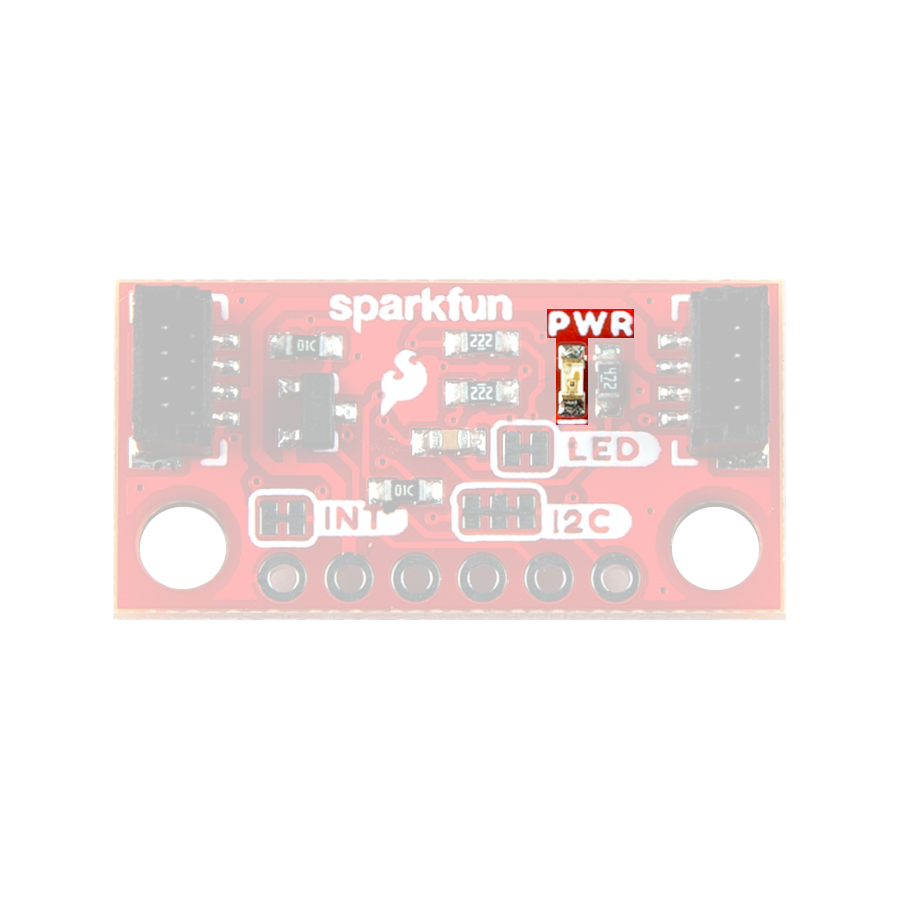{ width="400" }](./assets/img/hookup_guide/LED-power-mini.png "Click to enlarge")
</figure>

*The `PWR` status LED on the Qwiic Hall-Effect Sensor boards.*

!!! tip "Minimum Voltage"
	Users should keep in mind that the forward voltage of the red LED is lower than the minimum voltage required to power the TMAG5273 sensor. Therefore, the LED could potentially be *(dimly)* lit, when there isn't enough voltage to power the sensor.

## :fontawesome-solid-microchip:&nbsp; TMAG5273
The Qwiic Hall-Effect Sensor board features the [TMAG5273 sensor](./assets/component_documentation/tmag5273.pdf) from [Texas Instruments](https://www.ti.com). The TMAG5273 is low-power 3D [hall-effect sensor](https://en.wikipedia.org/wiki/Hall_effect_sensor) that is perfect for detecting and measuring changes in a nearby magnetic field. The magnetic range of the sensor is configurable to either ±40 mT or ±80 mT. In addition, the TMAG5273 features TI's integrated angle calculation engine (CORDIC) with gain adjustment, tamper detection, and temperature compensation (for NdBFe and ceramic magnet types). The operation sensor's interrupt can be configured to trigger through the I2C interface or an interrupt pin, based upon a wake-up/threshold setting or the conversion of a new measurement.

**Features:**

* Configurable I2C Address:
    * Default (7-bit): **0x35** *(hex)* or **`0110101`** *(bin)*
* Operating Voltage: **1.7 to 3.6V** (1)
* Current Draw:
	* Active: 2.3mA
	* Sleep Mode: 5nA
	* Wake-Up/Sleep (@ 1Hz): 1&micro;A
* Full-Scale Range: &plusmn;40mT or &plusmn;80mT (2)
* Accuracy: &plusmn;5% (3)
	* Temperature Compensation (4)
* CORDIC Engine (5)
* Output Data Rate (Hz): (6)
	* 0.05, 0.2, 0.5, 1, 2, 10, 20, 33, 50, 66, 100, 200, or 1000
* Operating Temperature: -40 to 125&deg;C
* Interrupt Triggers:
	* Threshold
	* Conversion

1. The sensor may be unresponsive below 2.3V; its under-voltage range is 1.9 to 2.2V
2. The range on each axis
3. The typical sensitivity at room temperature
4. Adjusts for magnet type *(NdBFe or ceramic)*
5. Integrated angle calculation *(along a single axis)*
6. [CRC](https://en.wikipedia.org/wiki/Cyclic_redundancy_check "Cyclic Redundancy Check") can be enabled

<figure markdown>
[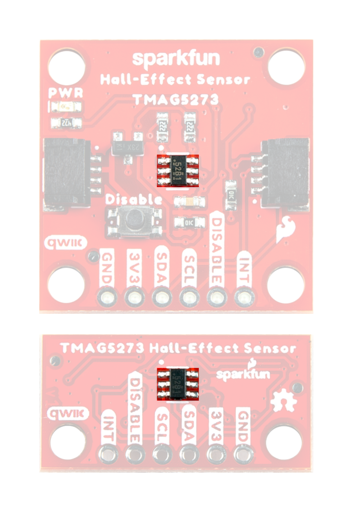{ width="400" }](./assets/img/hookup_guide/TMAG5273.png "Click to enlarge")
<figcaption markdown>The TMAG5273 sensor on the Qwiic Hall-Effect Sensor boards.</figcaption>
</figure>

??? tip "Sensor Alignment"
	=== "Position"
		We have positioned the TMAG5273 chip, based on the offset of the internal hall elements in the sensor.

		<figure markdown>
		[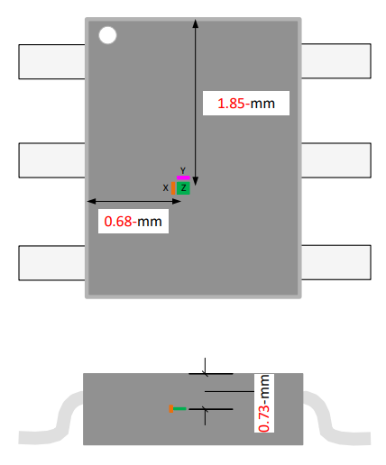{ width="250" }](./assets/img/hookup_guide/TMAG5273_position.png "Click to enlarge")
		<figcaption markdown>Position of the hall elements in the TMAG5273. Source: [TMAG5273 Datasheet](./assets/component_documentation/tmag5273.pdf)</figcaption>
		</figure>

		!!! info
			For exact measurements, users can download and reference the [eagle files](./assets/board_files/eagle_files.zip) of the boards. We recommend referencing the sensor's position based on the board's CNC milled, mounting holes.
			
			!!! note
				In manufacturing, we panelize our boards on a single [PCB](https://en.wikipedia.org/wiki/Printed_circuit_board "Printed Circuit Board") with a v-score separation. This is an efficient method to assemble multiple boards at once. After the panel is populated, cleaned, and inspected, the individual boards are separated by slicing the v-scores.

				While efficient, this process means that measurements referencing the edges of the PCB won't be as accurate when compared to the included mounting holes.

	=== "Orientation"
		The orientation of the sensor's axes is illustrated in the figure below.

		<figure markdown>
		[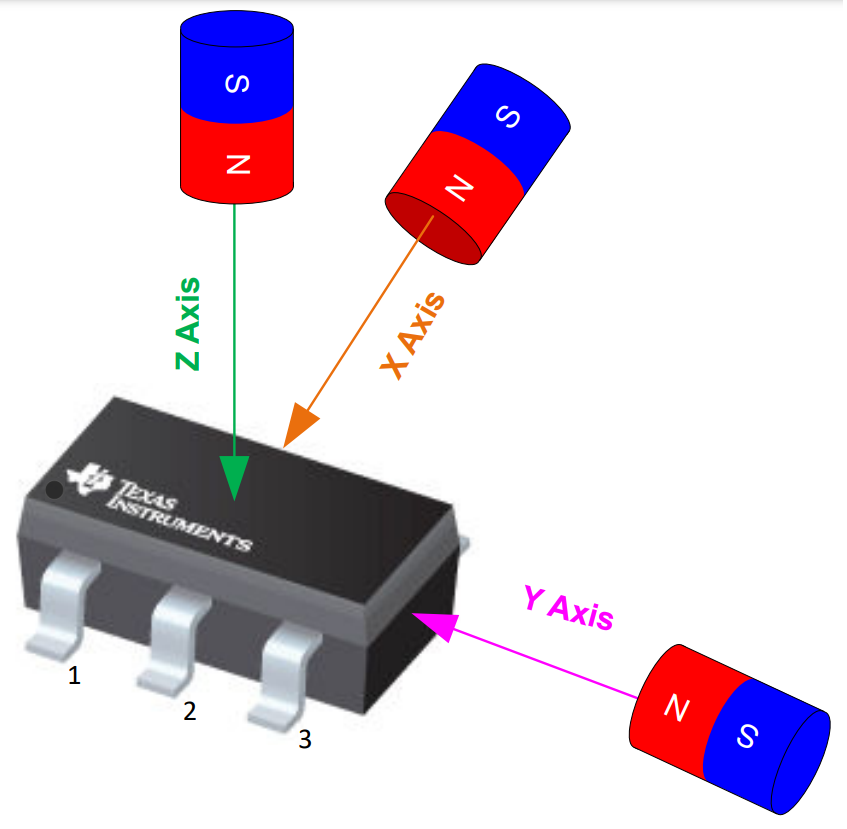{ width="250" }](./assets/img/hookup_guide/TMAG5273_axes.png "Click to enlarge")
		<figcaption markdown>The magnetic field orientation of the TMAG5273 hall-effect sensor. The TMAG5273's orientation is indicated by the black dot, just below the TI logo. Source: [TMAG5273 Datasheet](./assets/component_documentation/tmag5273.pdf)</figcaption>
		</figure>

		!!! info
			The orientation of the TMAG5273 sensor is indicated by the white silkscreen dot, next to the sensor, on the [PCB](https://en.wikipedia.org/wiki/Printed_circuit_board "Printed Circuit Board") of the Qwiic Hall-Effect Sensor boards. That dot correlates with the black dot just below the Texas Instruments logo in the figure above. 

??? note "Interrupt Operation"
	The interrupt function for the TMAG5273 can be set up to operate on either the `INT` or `SCL` pins. Users can also configure what triggers the interrupt, a threshold or data conversion. Control of the interrupt's operation is managed in the following registers:

	* `DEVICE_CONFIG_2`
	* `SENSOR_CONFIG_2`
	* `INT_CONFIG_1`

??? note "Magnetic Offset Correction"
	The TMAG5273 features an offset correction, on a pair of magnetic axes for situations where the sensor might be affected by a persistent magnetic field. The offsets are configured in the following registers:

	* `MAG_OFFSET_CONFIG_1`
	* `MAG_OFFSET_CONFIG_2`
	* `SENSOR_CONFIG_2`

	<figure markdown>
	[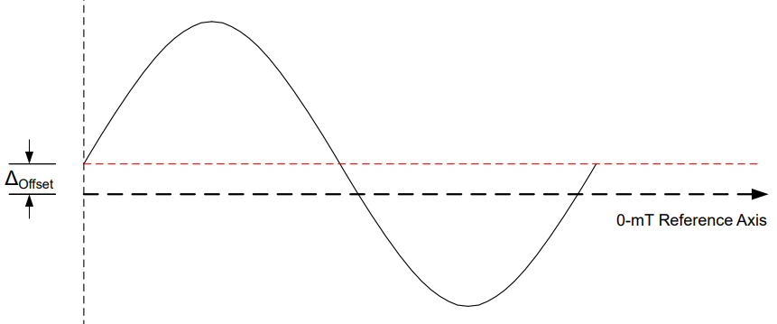{ width="350" }](./assets/img/hookup_guide/TMAG5273_magnetic_offset.png "Click to enlarge")
	<figcaption markdown>The magnetic flux measurements of a sine curve with an offset above the reference axis. Source: [TMAG5273 Datasheet](./assets/component_documentation/tmag5273.pdf)</figcaption>
	</figure>

??? note "Gain Adjustment"
	The TMAG5273 features a gain adjustment, on a pair of magnetic axes for situations where a magnet's rotation axis is offset from the position of the sensor's hall elements. The gain adjustments are configured in the following registers:

	* `MAG_GAIN_CONFIG`
	* `SENSOR_CONFIG_2`

	<figure markdown>
	[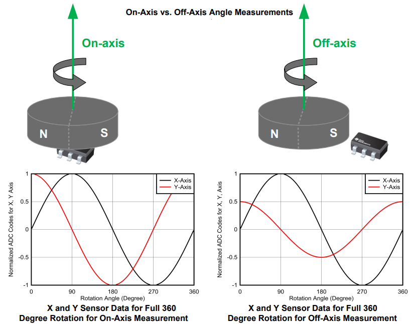{ width="350" }](./assets/img/hookup_guide/TMAG5273_gain_adjustment.png "Click to enlarge")
	<figcaption markdown>The magnetic flux measurements of the TMAG5273 utilizing a magnet, with an on-axis and off-axis position. Source: [TMAG5273 Datasheet](./assets/component_documentation/tmag5273.pdf)</figcaption>
	</figure>

??? example "Tamper Detection"
	Magnetic tamper detection can be employed with the TMAG5273 by continuously monitoring for external magnetic fields. For more details, users can reference section **8.2.1** of the [TMAG5273 datasheet](./assets/component_documentation/tmag5273.pdf) and the [application note](./assets/component_documentation/sboa514a.pdf).

!!! info
	For more details, users can reference the [TMAG5273 datasheet](./assets/component_documentation/tmag5273.pdf).

## Breakout Pins
There are six [PTH](https://en.wikipedia.org/wiki/Through-hole_technology "Plated Through Holes") pins broken out on the Qwiic Hall-Effect Sensor boards. The pins are evenly spaced at 0.1" on the outer edge of the board; perfect for attaching [headers](https://www.sparkfun.com/categories/381). These pins provide access to the I2C interface and interrupt pin of the TMAG5273 sensor; and included is a `DISABLE` pin that controls the power to the sensor.

!!! note
	The I2C interface can also be accessed through the Qwiic connectors on the board.

### Disable Pin
Unfortunately, the TMAG5273 doesn't incorporate a software reset. The intended use of the TMAG5273 is to hard reset the sensor's power with a [GPIO](https://en.wikipedia.org/wiki/General-purpose_input/output "General Purpose I/O") pin. However, with the Qwiic connect system, users may not want to power cycle the other Qwiic devices on the system. Therefore, we have incorporated `DISABLE` pin whose circuitry allows users to reset the TMAG5273, without interrupting the power of the Qwiic connect system.

<figure markdown>
[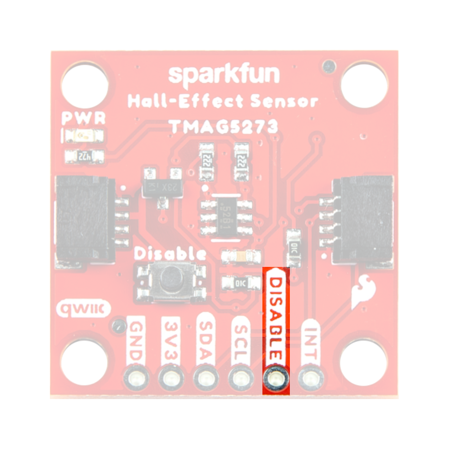{ width="400" }](./assets/img/hookup_guide/pins-disable2-1x1.png "Click to enlarge")
</figure>

<figure markdown>
[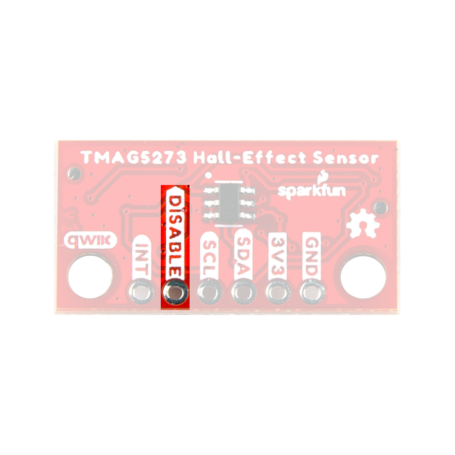{ width="400" }](./assets/img/hookup_guide/pins-disable-mini.png "Click to enlarge")
</figure>

*The `DISABLE` pin on the Qwiic Hall-Effect Sensor boards.*

!!! info
	For more details, users can reference the [schematic](./assets/board_files/schematic.pdf) and the [TMAG5273 datasheet](./assets/component_documentation/tmag5273.pdf).

#### Disable Button
A ++"Disable"++ button is only provided on the regular, 1" x 1" Qwiic board. This button is connected to the same reset circuitry of the `DISABLE` pin.

<figure markdown>
[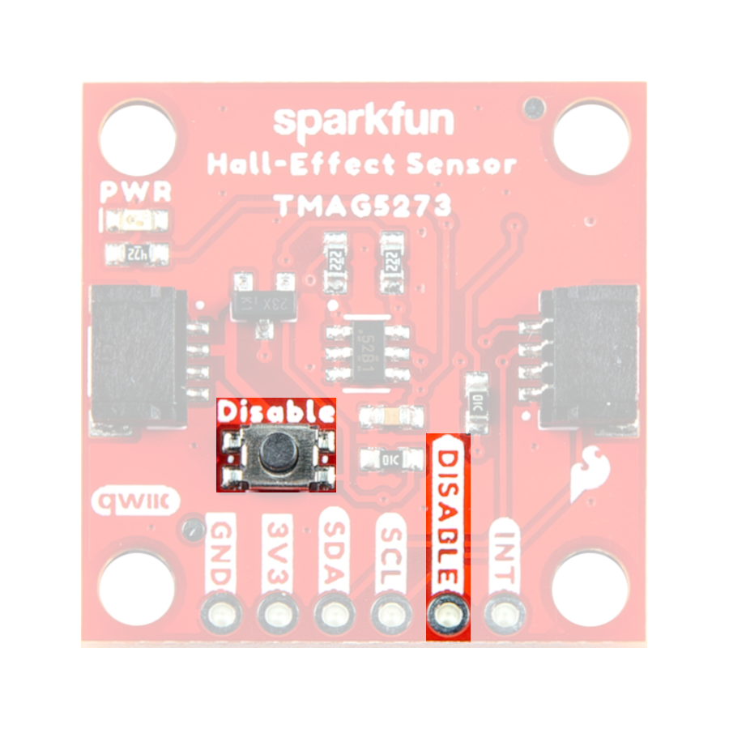{ width="400" }](./assets/img/hookup_guide/buttons-disable-1x1.png "Click to enlarge")
<figcaption markdown>The ++"Disable"++ button on the Qwiic Hall-Effect Sensor.</figcaption>
</figure>

!!! tip
	The button casing appears to be ferromagnetic. Therefore, a strong magnetic field *(i.e. from a rare Earth magnet)* could potentially exert enough force to rotate or lift the board.

### I2C Pins
The I2C interface can also be accessed either through the breakout pins or the Qwiic connectors on the board. In most cases, the Qwiic connector will be the simplest method to connect the Qwiic Hall-Effect Sensor boards to a microcontroller.

<figure markdown>
[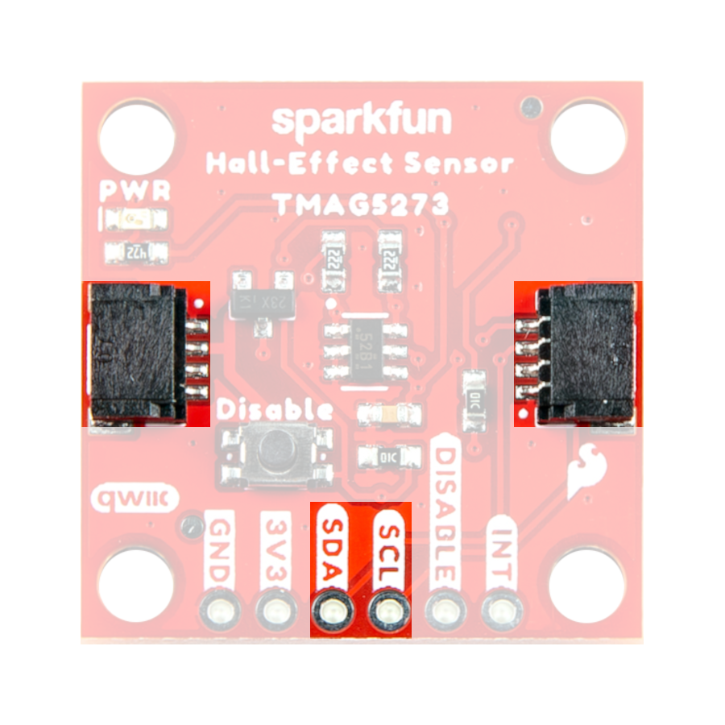{ width="400" }](./assets/img/hookup_guide/pins-i2c-1x1.png "Click to enlarge")
</figure>

<figure markdown>
[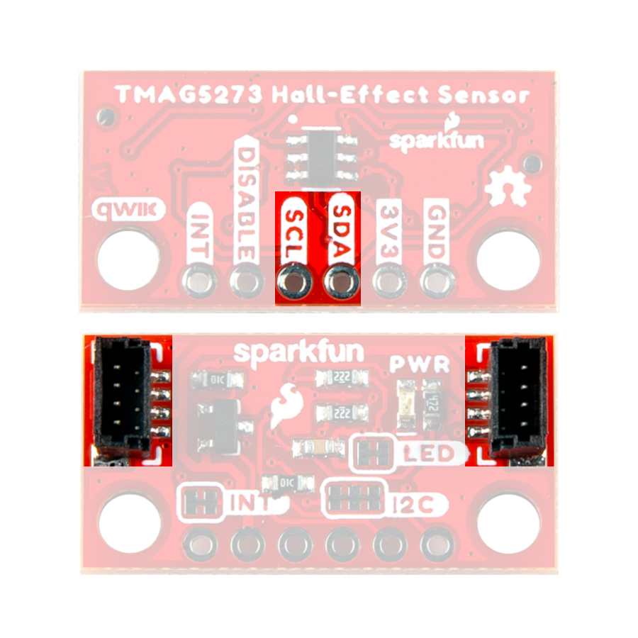{ width="400" }](./assets/img/hookup_guide/pins-i2c-mini.png "Click to enlarge")
</figure>

*I2C pins on the Qwiic Hall-Effect Sensor boards.*

??? tip " Qwiic Connector"
	Qwiic connectors are provided for users to seamlessly integrate I2C devices with [SparkFun's Qwiic Ecosystem](https://www.sparkfun.com/qwiic).

	

	

	<figure markdown>
	[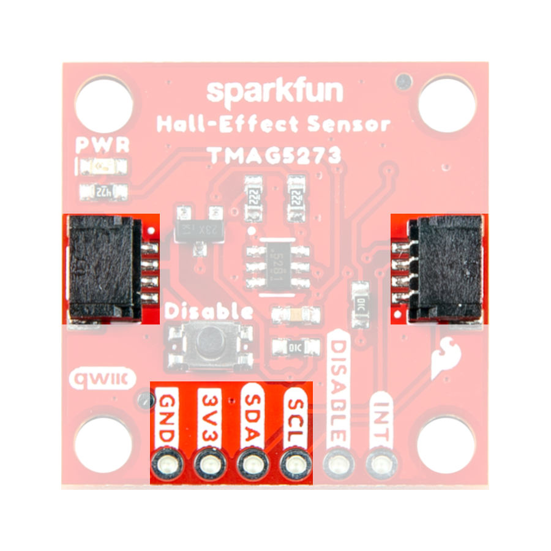{ width="400" }](./assets/img/hookup_guide/qwiic-1x1.png "Click to enlarge")
	</figure>

	

	

	<figure markdown>
	[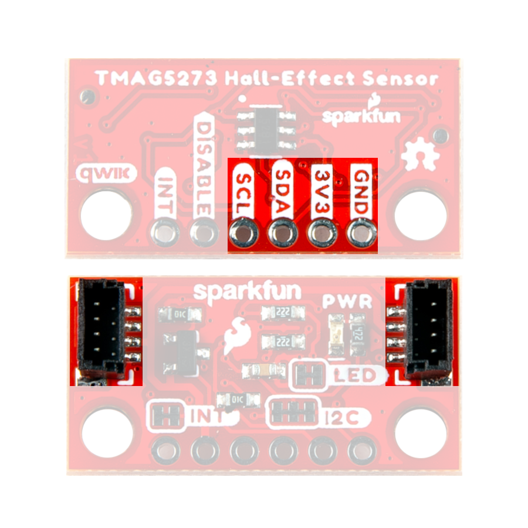{ width="400" }](./assets/img/hookup_guide/qwiic-mini.png "Click to enlarge")
	</figure>

	

	

	

	*Qwiic connector and its pins on the Qwiic Hall-Effect Sensor boards.*
	

!!! warning "Interrupt Function"
	TI does not recommend sharing the same I2C bus with multiple secondary devices when using the `SCL` pin for interrupt function. The `SCL` interrupt may cause bus contention issues that would corrupt the I2C transactions with other secondary devices, when present on the same I2C bus.

### Interrupt Pin
The interrupt function can be configured to operate through either the `SCL` or `INT` pins. When utilizing the interrupt pin (`INT`), the interrupt function can be configured to trigger once a conversion is completed or when a magnetic threshold has been surpassed.

<figure markdown>
[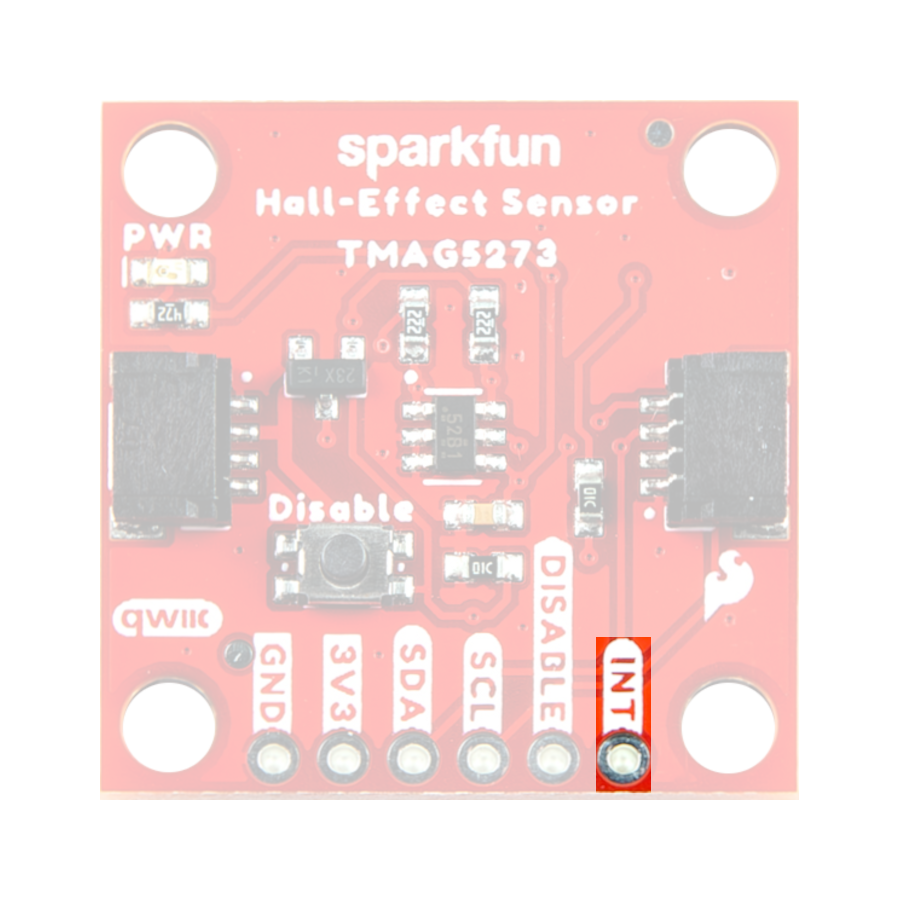{ width="400" }](./assets/img/hookup_guide/pins-interrupt-1x1.png "Click to enlarge")
</figure>

<figure markdown>
[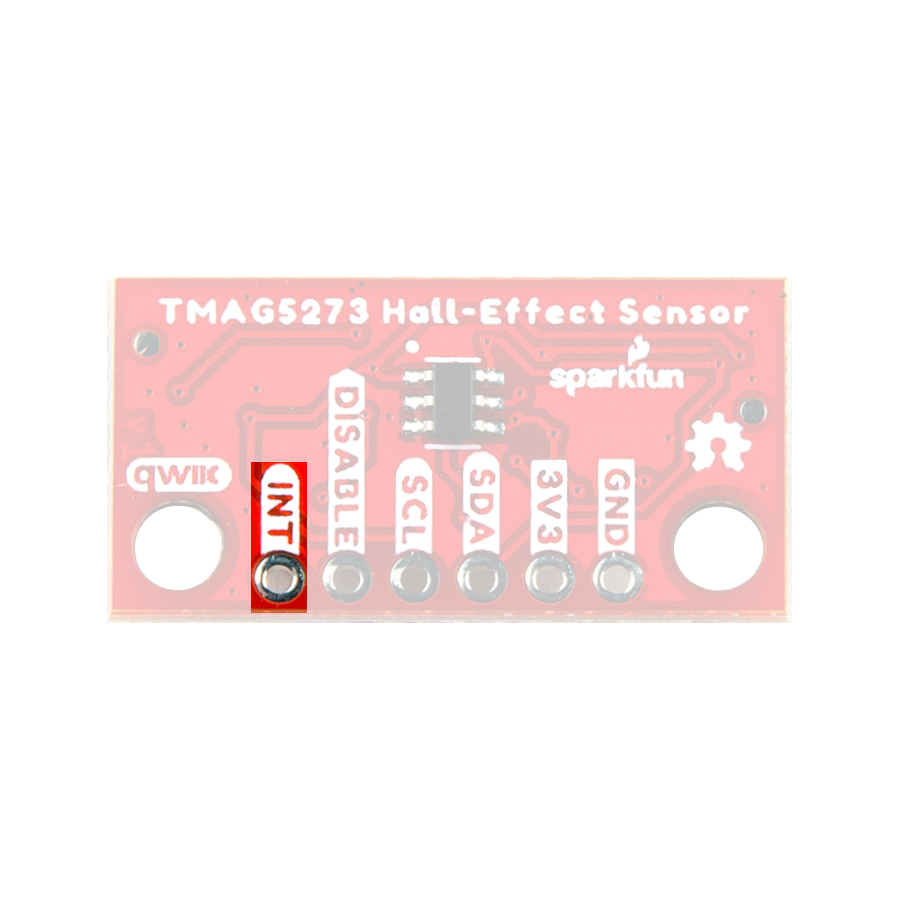{ width="400" }](./assets/img/hookup_guide/pins-interrupt-mini.png "Click to enlarge")
</figure>

*Interrupt pin on the Qwiic Hall-Effect Sensor boards.*

## Qwiic Connectors
Qwiic connectors are provided for users to seamlessly integrate with [SparkFun's Qwiic Ecosystem](https://www.sparkfun.com/qwiic). Otherwise, users can access the I2C interface through the [PTH pins broken out on the board](#i2c-interface).

<figure markdown>
[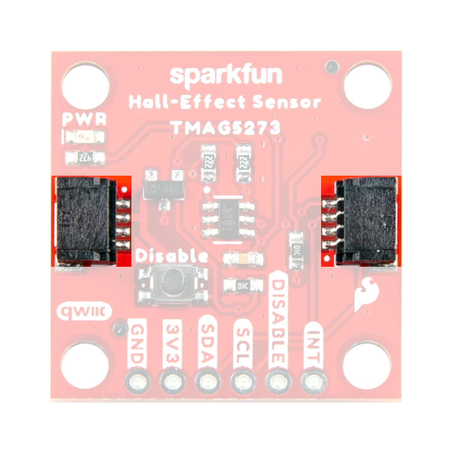{ width="400" }](./assets/img/hookup_guide/qwiic_connectors-1x1.png "Click to enlarge")
</figure>

<figure markdown>
[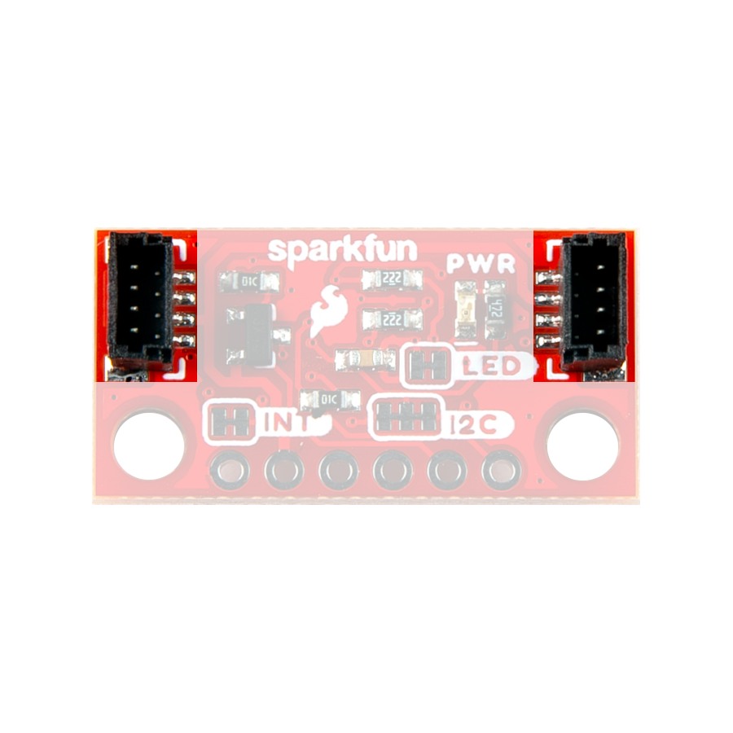{ width="400" }](./assets/img/hookup_guide/qwiic_connectors-mini.png "Click to enlarge")
</figure>

*Qwiic connectors on the Qwiic Hall-Effect Sensor boards.*

??? tip "What is Qwiic?"

	<!-- Qwiic Banner -->
	

	[{ width=400 }](https://www.sparkfun.com/qwiic)
	[{ width=400 }](https://www.sparkfun.com/qwiic)
	

	---

	The [Qwiic connect system](https://www.sparkfun.com/qwiic) is a solderless, polarized connection system that allows users to seamlessly daisy chain I2C boards together. Play the video below to learn more about the Qwiic connect system or click on the banner above to learn more about [Qwiic products](https://www.sparkfun.com/qwiic).
	
	
	

	

	<iframe src="https://www.youtube.com/embed/x0RDEHqFIF8" title="SparkFun's Qwiic Connect System" frameborder="0" allow="accelerometer; encrypted-media; gyroscope; picture-in-picture" allowfullscreen></iframe>
	

	

	!!! abstract "Features of the Qwiic System"

		=== "No Soldering"

			{ align="left" width="90" }
			{ align="left" width="90" }

			Qwiic cables (4-pin JST) plug easily from development boards to sensors, shields, accessory boards and more, making easy work of setting up a new prototype.

		=== "Polarized Connector"

			{ align="left" width="90" }
			{ align="left" width="90" }

			There's no need to worry about accidentally swapping the SDA and SCL wires on your breadboard. The Qwiic connector is polarized so you know you’ll have it wired correctly 	every time, right from the start.

			The PCB connector is part number SM04B-SRSS ([Datasheet](https://cdn.sparkfun.com/assets/parts/1/2/2/8/9/Qwiic_Connector_Datasheet.pdf)) or equivalent. The mating connector used on cables is part number SHR04V-S-B or an equivalent *(1mm pitch, 4-pin JST connector)*.

		=== "Daisy Chain-able"

			{ align="left" width="90" }
			{ align="left" width="90" }

			It’s time to leverage the power of the I2C bus! Most Qwiic boards will have two or more connectors on them, allowing multiple devices to be connected.

## Jumpers

??? note "Never modified a jumper before?"
	Check out our <a href="https://learn.sparkfun.com/tutorials/664">Jumper Pads and PCB Traces tutorial</a> for a quick introduction!

	

	-   <a href="https://learn.sparkfun.com/tutorials/664">
		<figure markdown>
		
		</figure>

		---

		**How to Work with Jumper Pads and PCB Traces**</a>

	

There are three jumpers on the back of the board that can be used to easily modify the hardware connections of the board.

* **LED** - This jumper can be used to disconnect power from the red, power LED for low-power applications.
* **I2C** - This jumper can be used to remove the pull-up resistors on the I2C bus.
* **INT** - This jumper can be used to remove the pull-up resistor from the `INT` pin.

<figure markdown>
[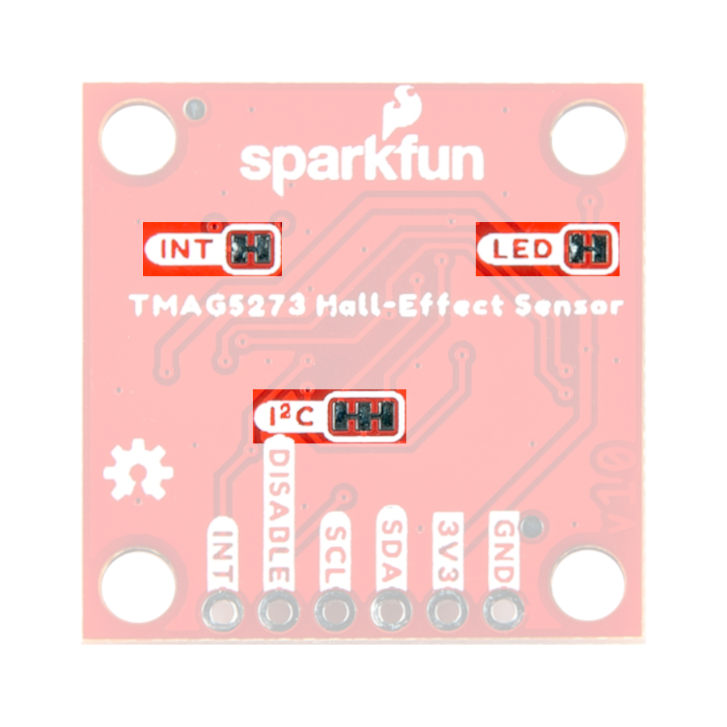{ width="400" }](./assets/img/hookup_guide/jumpers-1x1.png "Click to enlarge")
<figcaption markdown>Jumpers on the back of the Qwiic Hall-Effect Sensor board.</figcaption>
</figure>

<figure markdown>
[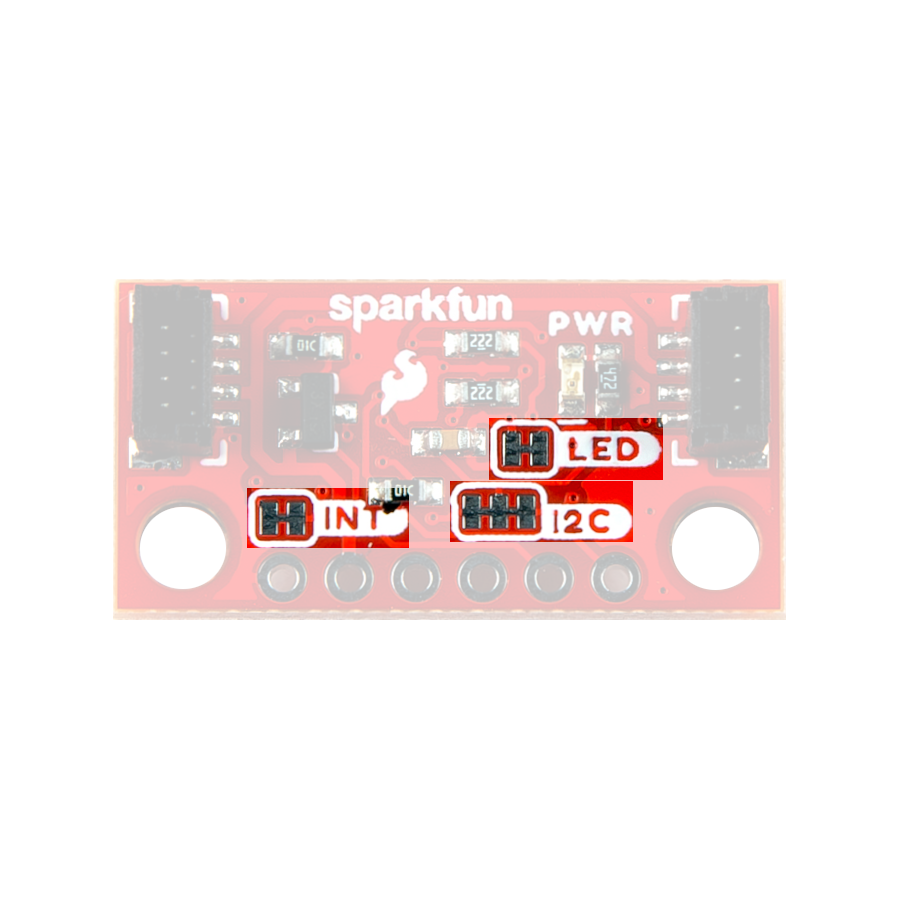{ width="400" }](./assets/img/hookup_guide/jumpers-mini.png "Click to enlarge")
<figcaption markdown>Jumpers on the Qwiic Hall-Effect Sensor board.</figcaption>
</figure>

